**English** · [简体中文](README.zh-CN.md)

<h1>Awesome Three.js Games</h1>

18 playable web games with their full source and runnable technique demos.

<a href="https://0xmariowu.github.io/awesome-threejs-games/">Live site</a> · <a href="https://0xmariowu.github.io/awesome-threejs-games/demos">Demos</a>

## Games

<table>
<tr>
  <td width="50%" valign="top">
    <a href="https://0xmariowu.github.io/awesome-threejs-games/p/hanakawa">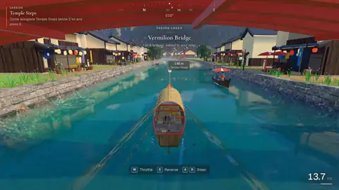</a> 
    <b>Hanakawa</b> 
    River cargo boating with boat simulation and WebGPU water rendering. 
    <a href="https://0xmariowu.github.io/awesome-threejs-games/games/hanakawa/index.html">▶ Play</a> · <a href="hanakawa/">Source</a>
  </td>
  <td width="50%" valign="top">
    <a href="https://0xmariowu.github.io/awesome-threejs-games/p/monolith-wilds">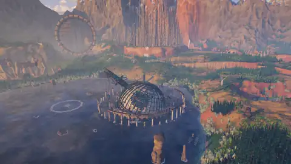</a> 
    <b>Monolith Wilds</b> 
    Explore a wasteland on foot or in flight, with procedural terrain and cinematic tour cameras. 
    <a href="https://0xmariowu.github.io/awesome-threejs-games/games/monolith-wilds/index.html">▶ Play</a> · <a href="monolith-wilds/">Source</a>
  </td>
</tr>
<tr>
  <td width="50%" valign="top">
    <a href="https://0xmariowu.github.io/awesome-threejs-games/p/inkwave">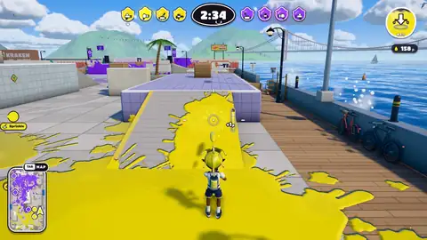</a> 
    <b>INKWAVE — Turf Riot</b> 
    4v4 turf battles with GPU painting, procedural characters and computer opponents. 
    <a href="https://0xmariowu.github.io/awesome-threejs-games/games/inkwave/index.html">▶ Play</a> · <a href="inkwave/">Source</a>
  </td>
  <td width="50%" valign="top">
    <a href="https://0xmariowu.github.io/awesome-threejs-games/p/longhoang-lyo">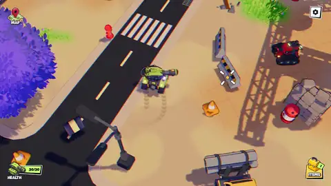</a> 
    <b>Long Hoang / Lyo</b> 
    An interactive portfolio with a combat robot, physics simulation and compressed textures. 
    <a href="https://0xmariowu.github.io/awesome-threejs-games/games/longhoang-lyo/index.html">▶ Play</a> · <a href="longhoang-lyo/">Source</a>
  </td>
</tr>
<tr>
  <td width="50%" valign="top">
    <a href="https://0xmariowu.github.io/awesome-threejs-games/p/vox-arcana">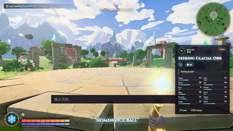</a> 
    <b>Vox Arcana</b> <small>Partly playable</small> 
    Elemental spell battles with text command parsing, spell trajectories and elemental reactions. 
    <a href="https://0xmariowu.github.io/awesome-threejs-games/games/vox-arcana/index.html">▶ Play</a> · <a href="vox-arcana/">Source</a>
  </td>
  <td width="50%" valign="top">
     
    <b>Sakuragaoka Station</b> 
    Walk through a Japanese station town in first person, with procedural modeling and toon shading. 
    <a href="https://0xmariowu.github.io/awesome-threejs-games/games/sakuragaoka-station/index.html">▶ Play</a> · <a href="sakuragaoka-station/">Source</a>
  </td>
</tr>
<tr>
  <td width="50%" valign="top">
    <a href="https://0xmariowu.github.io/awesome-threejs-games/p/smartgame-town">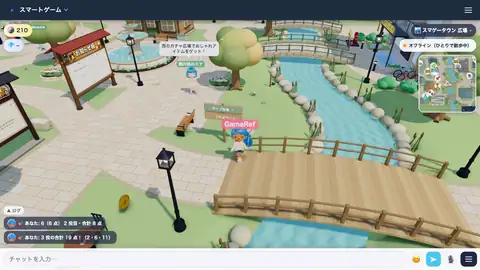</a> 
    <b>Smartgame Town</b> <small>Partly playable</small> 
    A 3D town with character customization, procedural scenes and layered character textures. 
    <a href="https://0xmariowu.github.io/awesome-threejs-games/games/smartgame-town/town/index.html">▶ Play</a> · <a href="smartgame-town/">Source</a>
  </td>
  <td width="50%" valign="top">
    <a href="https://0xmariowu.github.io/awesome-threejs-games/p/everdrift">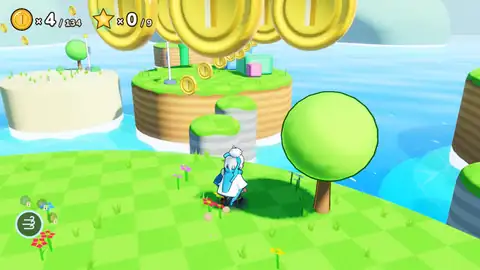</a> 
    <b>Everdrift</b> <small>Partly playable</small> 
    A wind-controlled platformer showing Godot in the browser and shaders. 
    <a href="https://0xmariowu.github.io/awesome-threejs-games/games/everdrift/index.html">▶ Play</a> · <a href="everdrift/">Source</a>
  </td>
</tr>
<tr>
  <td width="50%" valign="top">
    <a href="https://0xmariowu.github.io/awesome-threejs-games/p/scorch-podracer">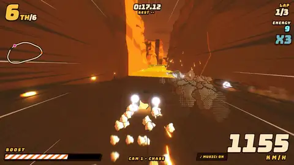</a> 
    <b>SCORCH — Desert Pod Racing</b> 
    Desert pod racing with procedural tracks, vehicles and synthesized sound effects. 
    <a href="https://0xmariowu.github.io/awesome-threejs-games/games/scorch-podracer/index.html">▶ Play</a> · <a href="scorch-podracer/">Source</a>
  </td>
  <td width="50%" valign="top">
    <a href="https://0xmariowu.github.io/awesome-threejs-games/p/moritsuki">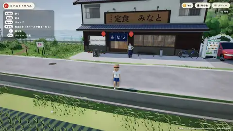</a> 
    <b>Moritsuki / なちゃっとの夏休み</b> <small>Partly playable</small> 
    A summer town and waterside minigames with geographic heightfields and shared game progress. 
    <a href="https://0xmariowu.github.io/awesome-threejs-games/games/moritsuki/moritsuki/index.html">▶ Play</a> · <a href="moritsuki/">Source</a>
  </td>
</tr>
<tr>
  <td width="50%" valign="top">
    <a href="https://0xmariowu.github.io/awesome-threejs-games/p/tidewater">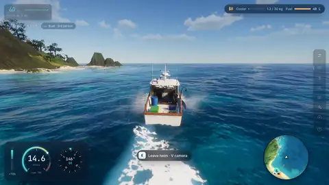</a> 
    <b>Tidewater</b> 
    Seaside fishing with a custom WebGPU engine, ocean waves and atmospheric rendering. 
    <a href="https://0xmariowu.github.io/awesome-threejs-games/games/tidewater/tidewater/index.html">▶ Play</a> · <a href="tidewater/">Source</a>
  </td>
  <td width="50%" valign="top">
    <a href="https://0xmariowu.github.io/awesome-threejs-games/p/shabondama-biyori">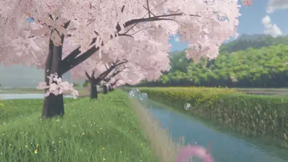</a> 
    <b>Shabondama Biyori / しゃぼん玉日和</b> 
    Blow bubbles in spring scenery, with bubble shading, wind simulation and an automatic camera. 
    <a href="https://0xmariowu.github.io/awesome-threejs-games/games/shabondama-biyori/_f/1790342986-3d06/index.html">▶ Play</a> · <a href="shabondama-biyori/">Source</a>
  </td>
</tr>
<tr>
  <td width="50%" valign="top">
    <a href="https://0xmariowu.github.io/awesome-threejs-games/p/arkenfall">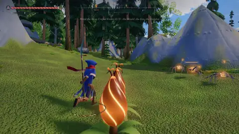</a> 
    <b>Arkenfall</b> 
    Open-world action adventure with procedural terrain, character animation and background generation. 
    <a href="https://0xmariowu.github.io/awesome-threejs-games/games/arkenfall/index.html">▶ Play</a> · <a href="arkenfall/">Source</a>
  </td>
  <td width="50%" valign="top">
    <a href="https://0xmariowu.github.io/awesome-threejs-games/p/tableparty-kart">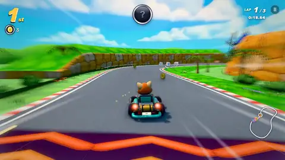</a> 
    <b>Sunsprint / Tableparty Kart</b> <small>Partly playable</small> 
    Kart racing with track-coordinate simulation, drift boosts and computer drivers. 
    <a href="https://0xmariowu.github.io/awesome-threejs-games/games/tableparty-kart/kart/index.html">▶ Play</a> · <a href="tableparty-kart/">Source</a>
  </td>
</tr>
<tr>
  <td width="50%" valign="top">
    <a href="https://0xmariowu.github.io/awesome-threejs-games/p/cloudkeep">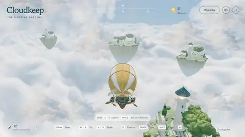</a> 
    <b>Cloudkeep</b> 
    Explore floating islands by airship, with flight controls, a smooth follow camera and a model-building workflow. 
    <a href="https://0xmariowu.github.io/awesome-threejs-games/games/cloudkeep/index.html">▶ Play</a> · <a href="cloudkeep/">Source</a>
  </td>
  <td width="50%" valign="top">
    <a href="https://0xmariowu.github.io/awesome-threejs-games/p/antikythera">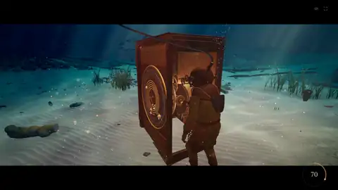</a> 
    <b>Antikythera</b> 
    Dive for bronze gears, brush away sediment, assemble an ancient mechanism and turn its crank to predict an eclipse. 
    <a href="https://0xmariowu.github.io/awesome-threejs-games/games/antikythera/index.html">▶ Play</a> · <a href="antikythera/">Source</a>
  </td>
</tr>
<tr>
  <td width="50%" valign="top">
    <a href="https://0xmariowu.github.io/awesome-threejs-games/p/threejs-punk">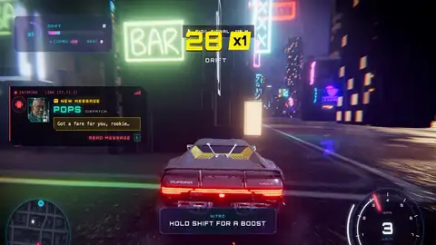</a> 
    <b>Threejs-Punk Drive</b> 
    Drive and drift through a rainy neon city, explore on foot and inspect sports cars in the garage. 
    <a href="https://0xmariowu.github.io/awesome-threejs-games/games/threejs-punk/index.html">▶ Play</a> · <a href="threejs-punk/">Source</a>
  </td>
  <td width="50%" valign="top">
    <a href="https://0xmariowu.github.io/awesome-threejs-games/p/tupi">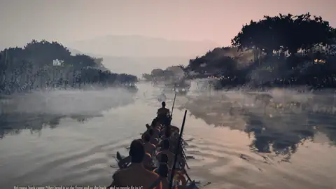</a> 
    <b>Tupi</b> 
    Follow a canoe fleet through rainy mangroves and move the camera around Bertioga in 1554. 
    <a href="https://0xmariowu.github.io/awesome-threejs-games/games/tupi/demos/tupi/index.html">▶ Play</a> · <a href="tupi/">Source</a>
  </td>
</tr>
</table>

## Tools

**FABOTANIC** — Generate 3D plants in the browser and drop them straight into your game.

<a href="https://0xmariowu.github.io/awesome-threejs-games/tools-app/fab-botanic/tl/fab-botanic/index.html">Open tool ↗</a> · <a href="https://amix-design.com/tl/fab-botanic/">Original site</a> · <a href="https://amix-design.com/tl/fab-botanic/license.html">Terms</a>

## Technique demos

- <b>Camera &amp; controls</b> · <a href="https://0xmariowu.github.io/awesome-threejs-games/demos?cat=camera">Live demos</a>: <a href="examples/arkenfall-camera/">Lock-on and camera collision</a> · <a href="examples/cloudkeep-flight/">Flight and follow camera</a> · <a href="examples/inkwave-3c/">Running, jumping and ink diving</a> · <a href="examples/monolith-tour/">Walking, flying and camera handoffs</a> · <a href="examples/shabondama-director/">Bubble camera director</a> · <a href="webgame-lab/src/scenes/inkwave-3c.tsx">3C and procedural bodies</a> · <a href="webgame-lab/src/scenes/feel-cam.tsx">Physics character and camera switching</a> · <a href="webgame-lab/src/scenes/feel.tsx">Physics character with fixed follow camera</a> · <a href="webgame-lab/src/scenes/drive.tsx">Driving with ecctrl vehicle mode</a> · <a href="webgame-lab/src/scenes/drone.tsx">Flying a drone with ecctrl propellers</a> · <a href="webgame-lab/src/scenes/planet.tsx">Planet and wall walking with ecctrl custom gravity</a> · <a href="webgame-lab/src/scenes/cloudkeep-cam.tsx">cloudkeep follow camera</a> · <a href="webgame-lab/src/scenes/tank-cam.tsx">Tank-style camera</a>
- <b>Vehicles &amp; physics</b> · <a href="https://0xmariowu.github.io/awesome-threejs-games/demos?cat=vehicle">Live demos</a>: <a href="examples/scorch-racing/">Pod racing physics</a> · <a href="examples/punk-engine-audio/">Engine audio</a> · <a href="examples/tupi-paddling-fleet/">Tupi · Paddling fleet</a> · <a href="webgame-lab/src/scenes/ropes.tsx">Ropes and hinges: bridge, chains and lamps</a>
- <b>Combat</b> · <a href="https://0xmariowu.github.io/awesome-threejs-games/demos?cat=combat">Live demos</a>: <a href="examples/arkenfall-combat/">Combos and parry timing</a> · <a href="examples/vox-reactions/">Elemental reaction playground</a>
- <b>AI &amp; crowds</b> · <a href="https://0xmariowu.github.io/awesome-threejs-games/demos?cat=ai">Live demos</a>: <a href="examples/cloudkeep-ecology/">Feeding, capture and ecology</a> · <a href="examples/scorch-race-ai/">Look-ahead racing AI</a> · <a href="webgame-lab/src/scenes/inkwave-ai.tsx">Goal scoring and navigation</a> · <a href="webgame-lab/src/scenes/npc.tsx">NPC behavior: wandering, fleeing and chasing</a> · <a href="webgame-lab/src/scenes/navcrowd.tsx">Crowd pathfinding in a town</a>
- <b>Characters &amp; animation</b> · <a href="https://0xmariowu.github.io/awesome-threejs-games/demos?cat=animation">Live demos</a>: <a href="webgame-lab/src/scenes/inkwave-ui.tsx">UI motion language</a> · <a href="webgame-lab/src/scenes/retarget.tsx">Animation retargeting</a> · <a href="webgame-lab/src/scenes/crowd.tsx">An animated crowd</a>
- <b>Rendering &amp; post-processing</b> · <a href="https://0xmariowu.github.io/awesome-threejs-games/demos?cat=rendering">Live demos</a>: <a href="examples/cloudkeep-atmosphere/">Cloud sea and in-cloud fog</a> · <a href="examples/inkwave-paint/">Ink on floors and walls</a> · <a href="examples/shabondama-bubble/">Bubble film iridescence</a> · <a href="examples/tupi-forest-impostors/">Tupi · Forest impostors</a> · <a href="webgame-lab/src/scenes/inkwave-materials.tsx">Materials and lighting</a> · <a href="webgame-lab/src/scenes/look.tsx">Base scene lighting</a> · <a href="webgame-lab/src/scenes/look-post.tsx">Scene lighting and post-processing</a> · <a href="webgame-lab/src/scenes/look-presets.tsx">One-click scene presets</a> · <a href="webgame-lab/src/scenes/lut.tsx">Cinematic color grading with LUT</a> · <a href="webgame-lab/src/scenes/motion-blur.tsx">Motion blur</a> · <a href="webgame-lab/src/scenes/ssgi.tsx">Global illumination (SSGI)</a> · <a href="webgame-lab/src/scenes/sky.tsx">Physical sky</a> · <a href="webgame-lab/src/scenes/volume-cloud.tsx">Volumetric clouds</a> · <a href="webgame-lab/src/scenes/fog.tsx">Height fog</a> · <a href="webgame-lab/src/scenes/rain.tsx">Rain</a> · <a href="webgame-lab/src/scenes/lightning.tsx">Lightning</a> · <a href="webgame-lab/src/scenes/atmosphere.tsx">Atmosphere and volumetric clouds for large worlds</a>
- <b>Water</b> · <a href="https://0xmariowu.github.io/awesome-threejs-games/demos?cat=water">Live demos</a>: <a href="examples/tidewater-ocean/">Waves and buoyancy</a> · <a href="examples/tupi-rain-river/">Tupi · Rain river</a> · <a href="webgame-lab/src/scenes/ocean.tsx">Ocean surface with WebGPU</a> · <a href="webgame-lab/src/scenes/pool.tsx">Pool with flowing water</a> · <a href="webgame-lab/src/scenes/shallow.tsx">Shallow water around a character</a>
- <b>Effects &amp; particles</b> · <a href="https://0xmariowu.github.io/awesome-threejs-games/demos?cat=effects">Live demos</a>: <a href="webgame-lab/src/scenes/inkwave-combat.tsx">Combat feedback chain</a> · <a href="webgame-lab/src/scenes/quarks.tsx">Particles: campfire, explosions and magic</a> · <a href="webgame-lab/src/scenes/flames.tsx">Flames with node materials</a> · <a href="webgame-lab/src/scenes/volume-fire.tsx">Volumetric fire</a> · <a href="webgame-lab/src/scenes/cloth.tsx">Cloth blowing in the wind</a> · <a href="webgame-lab/src/scenes/birds.tsx">GPU bird flock</a>
- <b>World &amp; terrain</b> · <a href="https://0xmariowu.github.io/awesome-threejs-games/demos?cat=world">Live demos</a>: <a href="examples/monolith-terrain/">Terrain streaming</a> · <a href="examples/botanic-meadow/">A mixed wild field</a> · <a href="examples/botanic-phyllotaxis/">Leaf arrangements</a> · <a href="webgame-lab/src/scenes/inkwave-paint.tsx">Surface painting and gameplay rules</a> · <a href="webgame-lab/src/scenes/inkwave-world.tsx">Data-driven levels and props</a> · <a href="webgame-lab/src/scenes/trees.tsx">Procedural trees with wind</a> · <a href="webgame-lab/src/scenes/plants.tsx">WebGPU plant generator</a> · <a href="webgame-lab/src/scenes/destruct.tsx">Destructible geometry: holes and craters</a>
- <b>Gameplay &amp; rules</b> · <a href="https://0xmariowu.github.io/awesome-threejs-games/demos?cat=gameplay">Live demos</a>: <a href="examples/tidewater-fishing/">Fishing line tension</a>
- <b>Assets &amp; tools</b> · <a href="https://0xmariowu.github.io/awesome-threejs-games/demos?cat=tooling">Live demos</a>: <a href="examples/cloudkeep-flight/">Models and distant detail</a> · <a href="examples/moritsuki-characters/">Background character generation</a> · <a href="webgame-lab/src/scenes/inkwave-audio.tsx">Procedural sound and music</a> · <a href="webgame-lab/src/scenes/inkwave-diagnostics.tsx">Frame loop and lifecycle</a>

## Run locally

- Library: `node tools/library.mjs`
- Open: http://127.0.0.1:8080
- One game: `node tools/server.mjs <slug>`

## Credits and licenses

- <a href="https://hanakawa-boat-game.vercel.app/">Hanakawa</a> — License not recorded
- <a href="https://monolithwilds.vercel.app/">Monolith Wilds</a> — License not recorded
- INKWAVE — Turf Riot — Source archived in <a href="inkwave/">inkwave/</a> — MIT
- <a href="https://longhoang-lyo.com/">Long Hoang / Lyo</a> — No license stated — study use
- <a href="https://jev-spell.vercel.app/">Vox Arcana</a> — No license stated — study use
- <a href="https://github.com/Kenton-GMI/sakuragaoka-station/tree/main">Sakuragaoka Station</a> — MIT
- <a href="https://smartgame.jp/town/">Smartgame Town</a> — No license stated — study use
- <a href="https://everdrift.iliareingold.com/">Everdrift</a> — No license stated — study use
- <a href="https://scortch-podracer.netlify.app/">SCORCH — Desert Pod Racing</a> — No license stated — study use
- <a href="https://cda-social.github.io/moritsuki/">Moritsuki / なちゃっとの夏休み</a> — No license stated — study use
- <a href="https://dgreenheck.github.io/tidewater/">Tidewater</a> — MIT
- <a href="https://claude.ai/artifact/FozvXt7fcZ6ydzxndkRS1k">Shabondama Biyori / しゃぼん玉日和</a> — No license stated — study use
- <a href="https://www.arkenfall.site/">Arkenfall</a> — No license stated — study use
- <a href="https://tableparty.io/kart">Sunsprint / Tableparty Kart</a> — No license stated — study use
- <a href="https://github.com/0xmariowu/cloudkeep">Cloudkeep</a> — MIT
- <a href="https://claude.ai/artifact/ReCBQGZ4EirKSiEmT8XXfs">Antikythera</a> — No license stated — study use
- <a href="https://www.threejspunk.com/">Threejs-Punk Drive</a> — No license stated — study use
- <a href="https://www.rubenmarcus.dev/demos/tupi/">Tupi</a> — No license stated — study use
- <a href="https://amix-design.com/tl/fab-botanic/">FABOTANIC</a> — All rights belong to AMIX / トミナガハルキ. Non-commercial study copy with full credit, interface translated into Chinese/English; the author&#39;s terms (v1.0.0, 2026-09-28) do not grant mirroring, and this copy will be removed on the author&#39;s request.

Webgame Lab lists third-party assets in [webgame-lab/LICENSES.md](webgame-lab/LICENSES.md).
