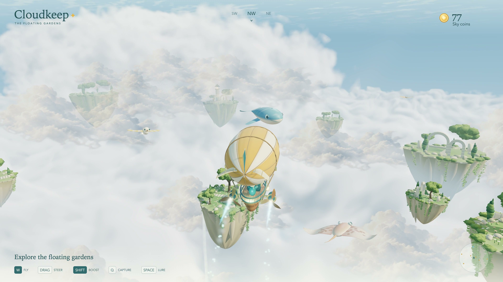

# Cloudkeep

A 3D sky exploration and creature-capture game. Pilot a wooden airship, lure
curious creatures with seeds, capture them through a glowing halo, and gather
gold coins. Discover cloud rays, whales, sun moths, sky koi and cloud jellies;
unlock lantern birds and restore the lighthouse.



**[Original prompt](prompts/original.txt)** ·
**[Prompt history](prompts/README.md)** ·
**[44-second 4K60 gameplay video](https://github.com/0xmariowu/cloudkeep/releases/download/v1.0.0/Cloudkeep-4K60-Gameplay.mp4)** ·
**[Smaller 1080p60 video](https://github.com/0xmariowu/cloudkeep/releases/download/v1.0.0/Cloudkeep-1080p60-Share.mp4)**

Built iteratively with Codex, Blender and Three.js. The original sky-theme prompt
is included verbatim; the current game also incorporates later gameplay, visual
and sound refinements. The source includes the complete game, editable Blender
scene, procedural modeling scripts, runtime assets and tests. See
[asset provenance](art/ASSETS.md) for the generated concept and cloud artwork.

## Play locally

Requires Node.js 22.12+ (tested with 22.22.3).

```sh
git clone https://github.com/0xmariowu/cloudkeep.git
cd cloudkeep
npm ci
npm run dev -- --port 5178
```

Open **http://127.0.0.1:5178/**. A current browser with WebGL 2 is required.
No accounts, API keys, external fonts, or paid services are needed to play.
All runtime art ships with the project. Music and sound begin with the Start
gesture. The sound button toggles audio and remembers your preference.

| Control | Action |
| --- | --- |
| Drag the sky | Turn and pitch the airship (mouse or touch) |
| W / S | Fly forward / reverse along the full 3D heading |
| A / D | Strafe left / right |
| Arrow keys | Turn left / right, pitch up / down |
| Right drag or Alt + drag | Orbit the camera independently |
| Mouse wheel | Zoom |
| C | Level the flight direction, center the camera and reset zoom |
| Double-click the sky | Capture the mouse for continuous steering; Escape releases |
| R / F | Rise / descend |
| Q | Hold to capture a nearby creature ahead |
| Space | Lure creatures with seeds; hold to keep releasing them |
| Shift + movement | Boost |
| E | Open the workshop |
| H | Flight guide |
| Escape | Pause / resume |

Touch controls appear on small screens and touch devices. Hold a direction button
with one finger and drag the sky with another. Capture, lure, boost and altitude
buttons support simultaneous touches. Locked mouse mode uses left-click for
capture. HUD menus pause the game and release mouse capture. Flight pitch is
limited to 45 degrees. The buoyant hull leans gently and settles upright on
release. A centered chase camera follows signed turns, keeps a level horizon,
and retracts around obstacles. C levels flight and recenters the camera.

Hold Q when a creature's capture ring appears (within 18 world units ahead).
The creature shrinks into the halo above the balloon, disappears, and releases
three visible coins. Coins briefly scatter before the magnet pulls them in.
The creature returns elsewhere after 9–14 seconds. Release Q to cancel a partial
capture. Space releases naturally replenishing seeds; feeding also earns coins
and helps creatures grow. Boosting startles nearby wildlife.

Nine residents occupy separate home ranges across five species. Three lantern
birds and a second whale are optional workshop upgrades. Wildlife wanders,
forms loose groups, follows food and avoids gardens. At most three creatures
respond to bait at once. Restoration requires twelve feeding/capture encounters,
the bird upgrade and 45 coins. The large mission panel is intentionally removed;
progress requirements are available in the workshop.

Progress saves after encounters, collections, respawns and purchases, every five
seconds during flight, and when leaving the page. Food, uncollected coins,
creature growth and pending respawns are preserved. Older saves retain earned
currency, upgrades and encounter totals; the population migration keeps the
most-grown residents and distributes the new species. A new browser/origin has
a separate sanctuary. Restart asks before replacing the current sanctuary.

## Build and test

```sh
npm test
npm run build
npm run preview -- --port 4178
```

`dist/` is the ready-to-serve static build. Serve it over HTTP rather than opening
`index.html` directly with a file URL. The tests cover flight timing, pitched flight, strafing, boundaries,
feeding, capture/cancellation, rewards, all six species, delayed respawn,
progression, upgrade limits, population migration and malformed saves. Browser checks also exercise the real
renderer, keyboard controls, purchases, restart and responsive layouts.

## Blender art

- Editable scene: **art/cloudkeep.blend**.
- Reproducible modeling source: **scripts/build_assets.py**.
- Additional creature authoring: **scripts/sky_creatures.py**.
- Mesh construction and batching: **scripts/modeling.py**.
- Game-ready models: **public/assets/*.glb**.
- Original visual direction: **art/concept.png**.
- Production sky panorama: **public/assets/sky.png**.
- Transparent cloud billow art: **public/assets/cloud-billow.png**.

The models are authored in Blender and batched by material and animation pivot
before export. The ship has sewn canvas, rounded timber courses, brass radial
engines, cabin windows, cargo, rigging and a pilot. Creature surfaces use painted
vertex colors, layered eyes, curved fins and independently animated parts.
Four garden variations include paths, olive trees, cypresses, flowers, ivy,
fountains, stone arches and a lighthouse.
Cliff profiles and buttresses use rounded continuous surfaces and smooth normals.
Stone has gentle color variation without a repeating bump pattern.
Distant gardens use reduced meshes; nearby gardens retain their botanical detail.

Three.js adds bending fins with matching shadows, blinking eyes, banking,
feeding and capture responses, cloth sheen, smooth stone and timber, sky-based
reflections, warm sunlight, opposite-side fill, cool rim light, white cloud bounce,
contact shading, restrained bloom,
flowing waterfalls and a layered cloud sea. A reduced-resolution cloud volume
includes raised world-space banks and internal shadows. Clouds stay naturally
white with warm highlights and cool shade. Foreground billows, cirrus and local mist add depth when flying
near clouds. The generated sky panorama provides reflection lighting.
A bounded 1,800-particle pool adds ambient motes, species trails, a spiraling
capture beam, release bursts, coin glints and pickup trails. Shift produces twin
blue-gold jets, sparks, light and a gently wider camera view. Rays shed stardust;
whales breathe puffs; moths scatter pollen; koi leave bubbles; jellies pulse and
trail glowing dew. Reduced-motion preferences disable decorative effects.

Audio uses Web Audio with distance attenuation, stereo positioning and a master
compressor. Propellers and wind follow speed; boost, collisions, capture, meals
and coins have separate cues. Each species has a distinct call. Quiet sustained
air tones overlap with slow fades and long reverberation, without a beat or
foreground melody. They recede during boost and fade out when the game pauses.
Engine harmonics, variable propeller pulses and gradual spool-up/down distinguish
mechanical boost from wind noise.

```sh
npm run assets
```

Tested with Blender 5.2.1. On macOS the script checks the standard Blender app
location. Elsewhere, put `blender` on PATH or set `BLENDER_BIN`. Regeneration
recreates the GLBs and generated Blender source from the modeling script; keep
manual Blender edits in a separate file if you want to retain them.

## Code map

- `simulation.ts`: fixed-step movement, food, creature behavior, rewards, economy,
  objectives and validated save reconstruction. No renderer dependency.
- `scene.ts`: GLB loading, scenery, camera obstruction handling, animation and effects.
- `flight-camera.ts`: stable orbit, world-up framing and camera focus smoothing.
- `atmosphere.ts`: world-space cloud volume and atmospheric sky.
- `materials.ts`: cloth, timber and stone detail, plus fin deformation.
- `effects.ts`: pooled particles, capture halo/beam, species trails and engine jets.
- `coins.ts`: shared gold coin mesh with a raised rim and sun stamp.
- `waterfalls.ts`: animated water curtains that dissolve into the cloud sea.
- `input.ts`: drag steering, mouse capture, free-look/zoom, keyboard and multi-touch
  controls; queued single-tap feeding.
- `ui.ts`: accessible DOM HUD, native dialogs, workshop, objectives and radar.
- `storage.ts`: versioned local storage with unavailable-storage handling.
- `audio.ts`: engine, boost, collision, species calls, rewards and spatial mixing.
- `music.ts`: beatless ambient tones, overlapping fades and audio-clock scheduling.
- `main.ts`: lifecycle, pause, autosave, fixed-step loop and integration.

This is a compact local single-player game. It has one sanctuary, six species,
and a restoration goal. Mobile layout and controls are included; performance
depends on the device's WebGL implementation.

## License and contributions

Project code, modeling scripts and original bundled artwork are provided under
the [MIT License](LICENSE). Third-party dependencies retain their own licenses.
The sky, cloud texture and visual concept were generated during development;
the Blender models are authored by the included Python scripts.

See [CONTRIBUTING.md](CONTRIBUTING.md) for the development workflow.
The 4K60 showcase uses fixed-step game-engine capture and original game audio;
it is a presentation recording, not a real-time performance benchmark.

## Technical references

[Three.js GLTFLoader](https://threejs.org/docs/pages/GLTFLoader.html),
[Three.js WebGLRenderer](https://threejs.org/docs/pages/WebGLRenderer.html),
[Vite](https://vite.dev/guide/).
