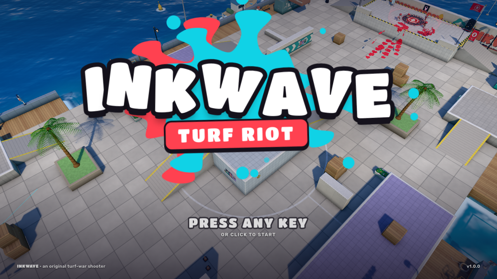

# INKWAVE — Turf Riot

> **基于 Three.js 的 4v4 涂地动作 Web 3D 游戏，使用程序化模型和合成音频。**
>
> 当前为本地单人游戏：1 名玩家和 7 名 AI 组成两队，不包含在线多人联机。

[](https://github.com/0xmariowu/inkwave/actions/workflows/ci.yml)
[](LICENSE)



---

## ⚡ 快速一键启动

由于本项目使用了现代浏览器的原生 **ES Modules** 和 `<script type="importmap">` 规范，受浏览器安全策略限制，**无法直接双击 `index.html`（`file://` 协议）运行**，必须通过本地 HTTP 服务访问。

需要支持 WebGL2 和 import maps 的现代桌面浏览器，并开启硬件加速。项目不需要 npm 安装或打包，依赖已包含在仓库中。

macOS / Linux 可使用启动脚本：

```bash
# 克隆项目并执行启动脚本（需要 Python 3、Bash 和 lsof）
git clone https://github.com/0xmariowu/inkwave.git
cd inkwave
./start.sh
```

Windows 或不使用脚本时，可在仓库根目录运行：

```bash
python3 -m http.server 8088 --bind 127.0.0.1
```

然后打开 <http://127.0.0.1:8088>。Windows 可将 `python3` 换成 `py -3`。按 `Ctrl+C` 停止服务。

> **脚本特性**：
> - 自动检测并避开已占用的端口（默认从 8088 向上寻找空闲端口）。
> - 启动轻量静态服务器并自动唤起默认浏览器打开游戏。
> - 首次载入由于需要由 GPU 实时编译 Shader 及生成程序化贴图，需要预热（Warming up…），时间取决于设备，提示 `Ready!` 后按任意键即可进入游戏。

---

## 🎮 操作键位指南

| 动作 | 键盘 / 鼠标按键 | 手柄映射（支持 Xbox / PS / Switch） |
| :--- | :--- | :--- |
| **移动** | `W` / `A` / `S` / `D` | 左摇杆 (L-Stick) |
| **转动视角 / 瞄准** | 鼠标滑动 | 右摇杆 (R-Stick) |
| **主武器射击 / 挥动** | 鼠标左键 (Left Click) | 右扳机 (RT / R2 / ZR) |
| **潜入墨汁（乌贼形态）** | `Shift` | 左扳机 (LT / L2 / ZL) |
| **跳跃 / 离开墨汁起跳** | 空格键 (`Space`) | A 键 / ✕ 键 / B 键 |
| **投掷副武器（水球炸弹）** | `E` 键 / 鼠标右键 | 右肩键 (RB / R1 / R) |
| **激活特殊大招 (Special)** | `Q` 键 / `F` 键 | 按下右摇杆 (R3) / 顶部面键 |
| **呼出战局小地图** | 按住 `Tab` 键 | 视角键 / 触摸板 / `-` 键 |
| **超级跳跃至队友 (Super Jump)** | 打开地图后按 `1` ~ `3` 跳至队友，`4` 回出生点 | 方向键十字键 |
| **退出指针锁定 / 暂停** | `Esc` 键 | Menu / Options / `+` 键 |

---

## 📑 核心技术与架构规范

架构笔记见下方文档。文档中的性能数字和浏览器版本要求尚未经过完整基准测试，请以实际代码和设备表现为准。

👉 **[查看完整技术白皮书与工程规范 (TECHNICAL_SPEC.md)](TECHNICAL_SPEC.md)**

### 技术要点摘要：
1. **零外部资产（Zero-Asset Proceduralism）**：
   - 仓库包含两款字体、预烘焙光照贴图和截图；**不包含外部 3D 模型（GLTF/FBX）与音频（MP3/WAV）文件**。
   - 人物网格、骨骼蒙皮、枪械、地图障碍、物理碰撞体全部通过数学几何（超椭球体、放样车削）代码建模。
2. **GPU 纹理空间涂地系统（Texture-Space Painting）**：
   - 3D 表面展开映射至 GPU Atlas 贴图，利用双三次 B-spline 滤镜实现圆润厚涂的高光立体凝胶感墨汁。
   - CPU 端维护对称的 0.25m 离散网格，执行完全相同的有机边缘方程，让渲染表现与玩法判定使用一致的边缘规则。
3. **分层程序化动画（Procedural Locomotion）**：
   - **完全无预制动作片段**。采用世界坐标足部锁定步态（World-locked Foot Plants）彻底消除滑步，配合两骨逆向运动学（Two-Bone IK）与 Verlet 发丝弹簧物理。
4. **Web Audio 纯数学 DSP 声音合成**：
   - 音效与多轨朋克电子 BGM 全部由振荡器、粉红/白噪声缓冲区、包络发生器在客户端实时演算合成。
5. **帧循环零分配（Allocation-Free Loop）**：
   - 物理、动画、粒子、HUD 通过复用对象减少内存分配；实际性能需要在目标设备上测量。

---

## 📁 源码目录结构

```
inkwave/
├── index.html                   # 网页主入口与 Three.js Import Map 映射
├── start.sh                     # 一键启动脚本
├── README.md                    # 本快速指南
├── TECHNICAL_SPEC.md            # 深度技术规范白皮书
├── styles/                      # 原生 CSS（ui.css, hud.css，支持 16:9 自适应缩放）
├── assets/
│   ├── fonts/                   # TitanOne-latin, Rubik-latin（全站仅有外部字体）
│   └── lightmaps/               # 场景光照遮蔽（AO）贴图与布局索引
├── vendor/three/                # Three.js (r186) 核心库与后处理扩展
└── src/
    ├── main.js                  # 游戏主启动器、状态机与每帧主循环
    ├── config.js                # 全局物理、武器、手感、配色配置
    ├── core/                    # ctx 事件总线、renderer 后处理管线、input 输入
    ├── game/                    # 角色动画、纯代码建模、武器弹道、自研物理与 AI 行为树
    ├── world/                   # 涂地系统、PBR 贴图生成器 (texlib)、关卡地图与环境
    ├── fx/                      # 墨汁飞溅、气泡、水花与屏幕后期粒子系统
    ├── audio/                   # Web Audio API 纯程序化音效与多轨音乐合成器
    └── ui/                      # 原生 DOM + 动态 SVG 界面（HUD 与菜单）
```


## Development

Run the repository checks with Node.js 22+, Python 3, and Bash:

```bash
bash scripts/check.sh
```

These checks validate JavaScript syntax, local module and asset paths, JSON files,
and shell syntax. They do not validate WebGL rendering or gameplay. For gameplay
changes, also follow the manual smoke checklist in [CONTRIBUTING.md](CONTRIBUTING.md).

## Scope and limitations

- Desktop keyboard/mouse and standard gamepads are supported by the input code;
  controller mappings depend on the browser. Touch controls are not implemented.
- Settings and progression are stored in browser local storage. Clearing site data
  resets them. There is no account service or multiplayer server.
- All game dependencies are served locally. The development server binds to
  loopback and is not intended as a production server.

## Contributing and security

See [CONTRIBUTING.md](CONTRIBUTING.md) for development and pull requests, and
[SECURITY.md](SECURITY.md) for private vulnerability reports.

## License and acknowledgements

Project code and project-authored assets are available under the [MIT License](LICENSE).
Bundled libraries and fonts retain their own licenses; see
[THIRD_PARTY_NOTICES.md](THIRD_PARTY_NOTICES.md).

INKWAVE is an independent project inspired by turf-painting action games. It is
not affiliated with or endorsed by Nintendo. Splatoon is a Nintendo trademark.
